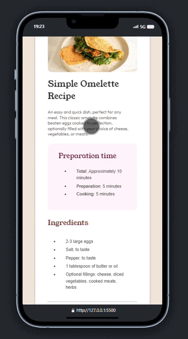
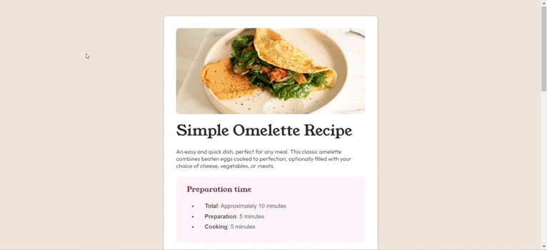

# Frontend Mentor - Recipe page solution

[Minha solução para este desafio](https://rafaelontour.github.io/receita)

This is a solution to the [Recipe page challenge on Frontend Mentor](https://www.frontendmentor.io/challenges/recipe-page-KiTsR8QQKm). Frontend Mentor challenges help you improve your coding skills by building realistic projects. 

### Built with

- Semantic HTML5 markup
- CSS custom properties

Responsividade usando a função clamp() e a propriedade width.

##

# Dispositivo móvel

# Computador

# Alterando tamanho

